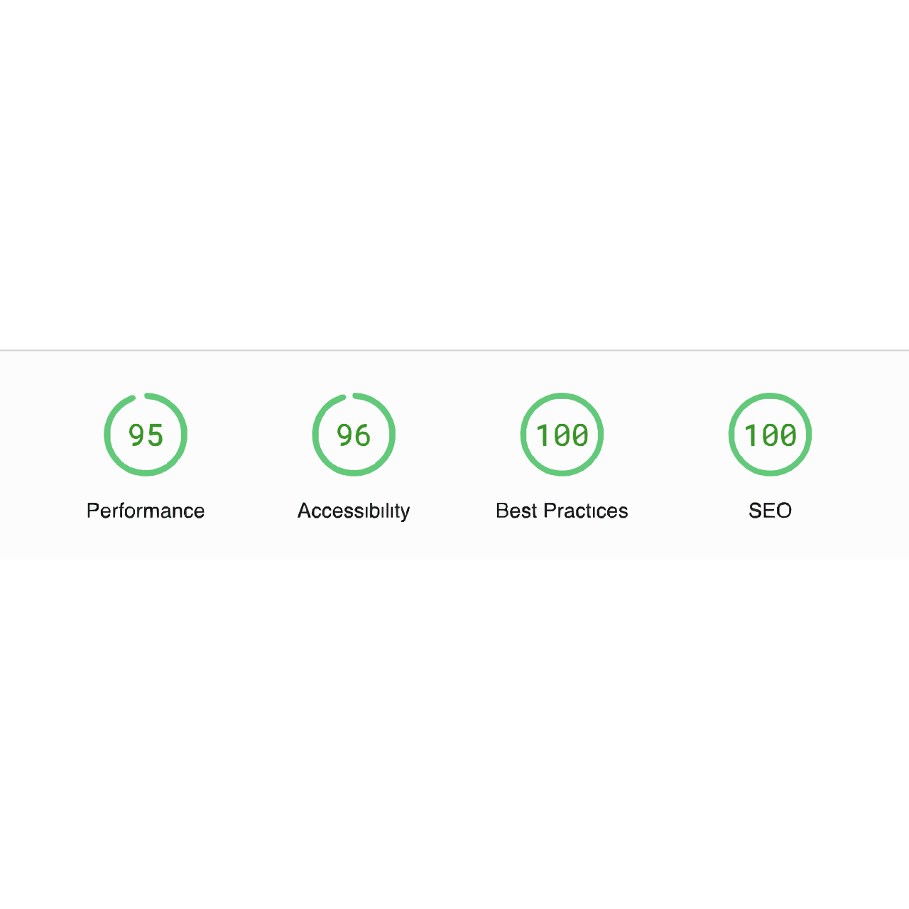

# Kono Agyemang Portfolio

![Kono Agyemang-portfolio]

![ts]

My portfolio website developed with Next.JS(SSG) and TypeScript. Tailwind CSS and GSAP is used for styling and animations. Light & Dark themes supported. Dark is first priotic.

## Features

- Responsive Design 
- Light & Dark themes 
- Fully Accessible 
- SEO Friendly 

## Tech Stack

**Frontend** - [NextJS](https://nextjs.org/), [React](https://reactjs.org/), [TypeScript](https://www.typescriptlang.org/)  
**Styling** - [Tailwind CSS](https://tailwindcss.com/)  
**Animations** - [GSAP](https://greenstock.com/)  
**Design & Prototype** - [Figma](https://figma.com/)  
**State Management** - [Zustand](https://zustand-demo.pmnd.rs/)  
**Deployment** - [Vercel](https://vercel.com/)

## Lighthouse Score

<a href="https://pagespeed.web.dev/analysis/https-devKono Agyemang-vercel-app/sgswm7q59t?form_factor=desktop">

<a>

## Running Locally

# kono-portfolio
